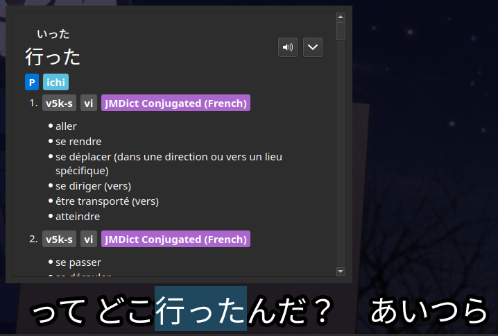

# Description
Convert JMDict files in YomiChan format into files containing the following inflections (affirmative and negative) of each verb in the source file:

- Non-Past Polite
- Past
- Past Polite
- Te-Form
- Imperative
- Conditional

All the heavy lifting is done by [PyKatsuyou](https://github.com/SmashinFries/PyKatsuyou) and its dependencies.

# Usage
```
python3 generate_ja_conjugations.py <input_file> <output_file>
```

Check out the [Releases page](https://github.com/precondition/Verb_inflections_JMDict/releases) to download pre-generated ZIPs.

# Motivation
The [Memento](https://github.com/ripose-jp/Memento) video player doesn't properly support the look-up of conjugated verbs in the subtitles (See issue [Parsing verb forms and helper verbs #109](https://github.com/ripose-jp/Memento/issues/109)). Adding dictionaries containing entries for conjugated verbs is a stop-gap solution to this problem.


